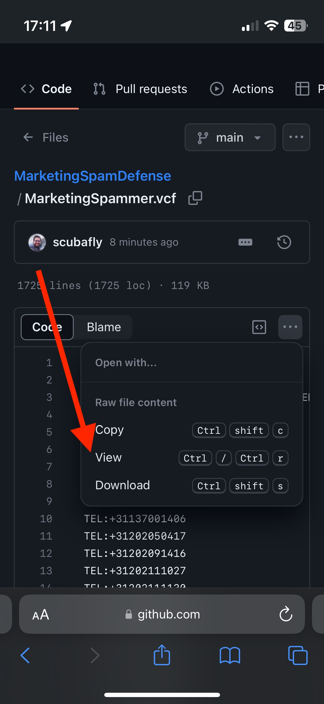

# Stop Energie Spam
Iedereen kent het wel, die irritante bellers die je proberen een goedkoper energiecontract willen aansmeren!
Dit is een lijst met bekende telefoonnummers die ongewenst bellen mbt je energiecontract? 

## Telefoonnummers
Download de .vcard en importeer deze in je telefoon, of open deze met een teksteditor voor de nummers. 
Zodra er een spamnummer belt zie je dat meteen en kun je deze wegdrukken of niet opnemen.

## Nieuwe Telecomwet
Op 1 juli 2021 is de nieuwe telecomwet ingegaan. Een bedrijf mag alleen bellen als je daadwerkelijk klant van ze bent. Ben je geen klant van ze, dan mogen ze jou niet bellen. 

Ook 1 juli 2021 gaan de telefoontje helaas gewoon door, vandaar dat ik Energie Spammer Contact heb aangemaakt en de nummers van de spammers aan toe voeg, eenmaal op de lijst neem ik niet meer op als ze bellen.

## Hoe werkt het installeren op een iPhone
Ga met je telefoon naar deze repo.

* Klik op Energie Spammer.vcf

* Klik op de ... drie puntjes en op "View raw"

* Je krijgt nu een dialoog waarmee je deze evil contactpersoon kan toevoegen.

* Scroll helemaal naar beneden, klik op als contactpersoon toevoegen ( of updaten ).

* Als je nu gebeld wordt zie je meteen dat het een spammer is :)

### Blokkeren van deze lijst met telefoonnummers. (Deze stap moet je herhalen na het updaten op ook de nieuwe nummers te blokkeren )
#### Volg hiervoor deze stappen:

* Ga naar de "Instellingen" app op je iPhone.

* Scroll naar beneden en tik op "Telefoon".

* Tik op "Geblokkeerd" onder het gedeelte "Geblokkeerd en identificatie".

* Tik op "Voeg toe" om een nieuwe geblokkeerde contactpersoon toe te voegen.

* Zoek en selecteer de contactpersoon waaraan je de geblokkeerde telefoonnummers wilt toevoegen.

* Mocht je de lijst willen updaten kun je het "Blokkeren van deze lijst met telefoonnummers" herhalen nadat je de contactpersoon opnieuw hebt toegevoegd.
